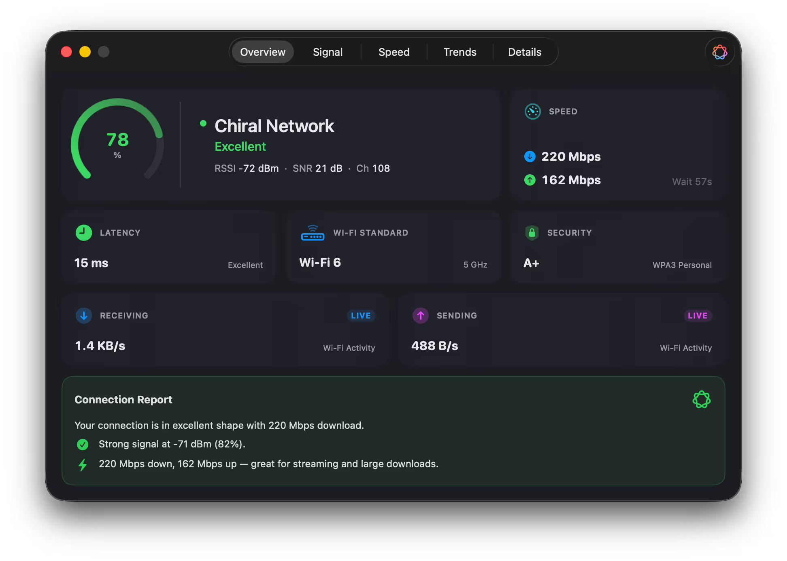
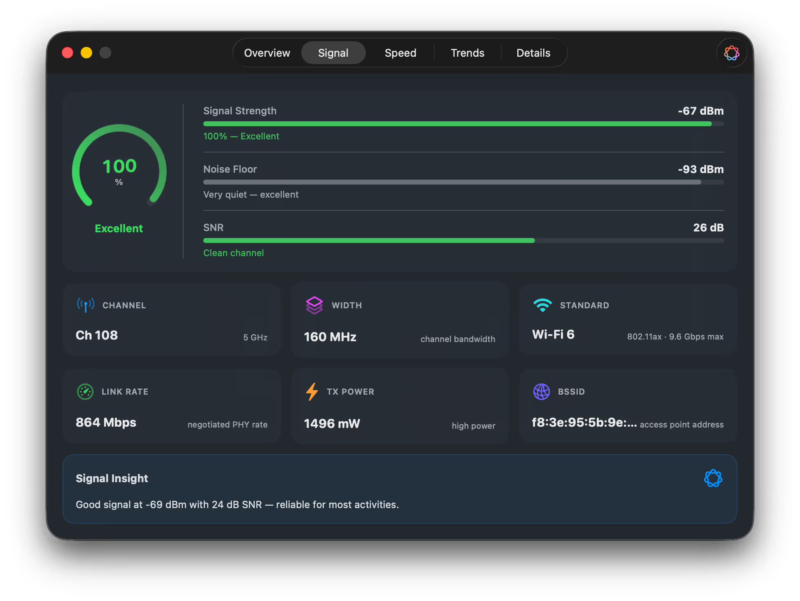
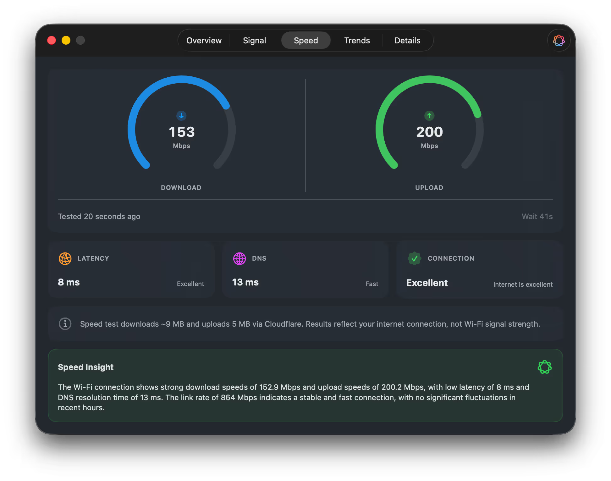
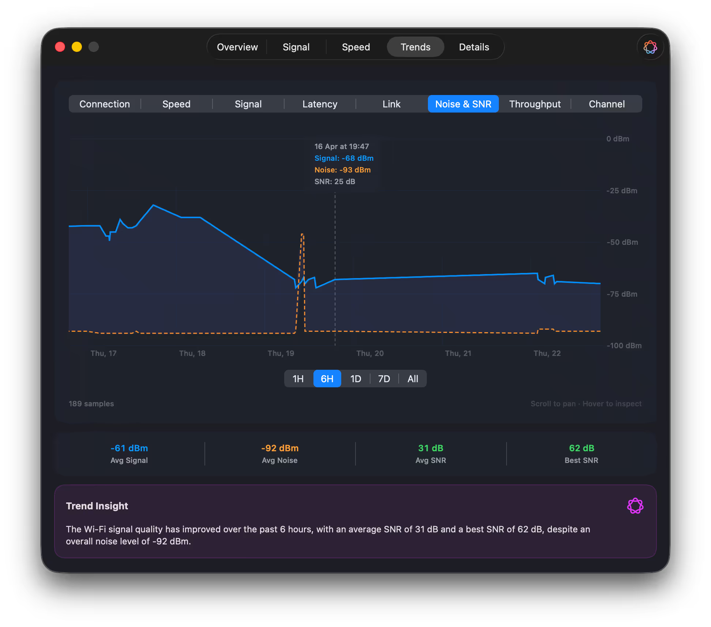
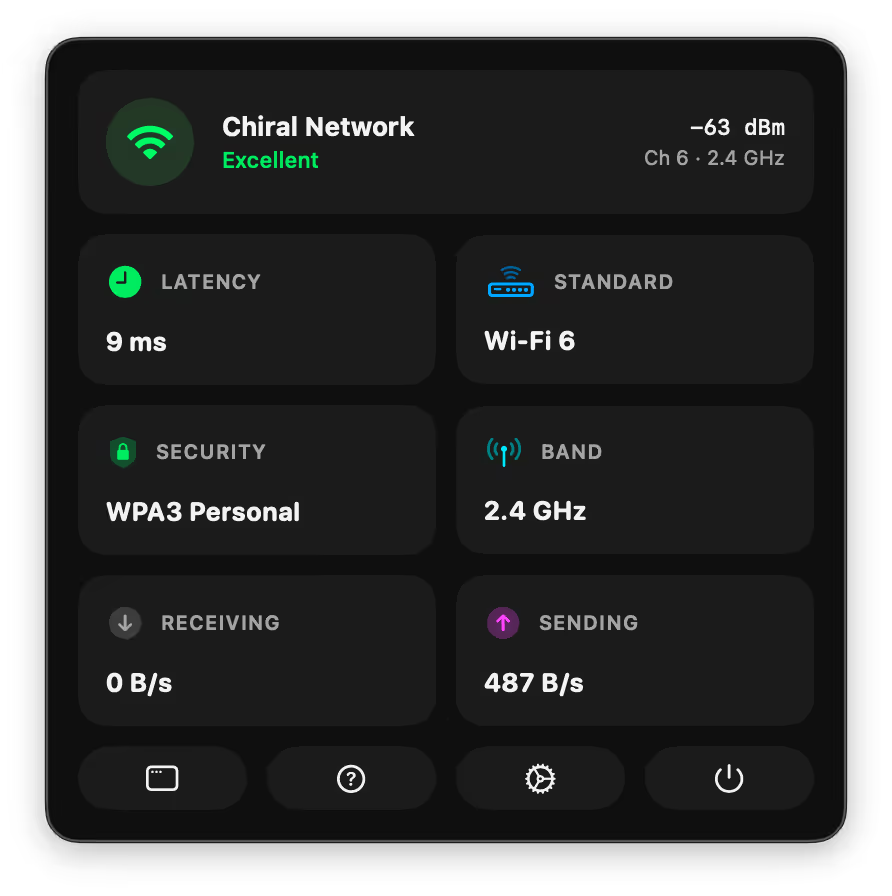

# Buike — Design

Personal rain forecast PWA. Free Buienalarm alternative without ads.

## Goal

Open app, see 2-hour precipitation forecast for current location. That's it.

## features for v1

- **PWA** — installable to home screen, works offline (cached shell)
- **Geolocation** — get user's current position
- **Rain graph** — 2-hour precipitation forecast in 5-minute intervals
- **Buienradar API** — `http://gadgets.buienradar.nl/data/raintext?lat={lat}&lon={lon}`

## features that are out of scope for v1

- Push notifications (needs backend for iOS)
- Background rain checks
- Multiple locations / favorites
- Weather beyond precipitation
- Historical data
- User authentication -> no account needed for v1
- Rain map, with graph over the netherlands like buienalarm

## Data Source

**Buienradar Rain Text API**

- Endpoint: `GET http://gadgets.buienradar.nl/data/raintext?lat={lat}&lon={lon}`
- Returns: plain text, one line per 5-minute slot, 24 lines (2 hours)
- Format per line: `{intensity}|{HH:MM}` where intensity is 0-255
- Intensity to mm/h: `10^((value - 109) / 32)` (0 = no rain)
- No API key required
- Free for non-commercial/personal use

## Tech Stack

- **Next.js** (App Router)
- **TypeScript**
- **PWA** via `next-pwa` or `@serwist/next` (service worker, manifest, offline)
- **Chart** — lightweight (Chart.js or plain SVG/canvas)
- **Tailwind CSS** — utility-first, mobile-first
- **Hosting** — Vercel (free tier)
- **API routes** — CORS proxy for Buienradar, future push notification backend

## UI

### Design Direction

Inspired by [Wifilicious](https://wifilicious.app/) — dark, card-based, bold values, clean typography.

**Reference screenshots:** see bottom of this file.

### Visual Language

- **Dark theme** — near-black background (`#0a0a0a`-ish), dark card surfaces (`#1a1a1a`)
- **Rounded cards** — subtle border or elevation, grouped by function
- **Bold primary values** — large font weight, small muted label above
- **Color-coded intensity** — green (none/light), yellow (moderate), orange (heavy), red (extreme)
- **Accent color** — blue or teal for rain-related highlights

### V0.1 Layout — Proof of Concept

Just the precipitation chart. Prove the data works, expand later.

```
┌──────────────────────────────┐
│                               │
│  📍 Amsterdam                │
│                               │
│ ┌──────────────────────────┐ │
│ │  ▁▂▃▅▇█▇▅▃▂▁░░░░░░░░░░░ │ │  ← area chart, 2h window
│ │  now    +30m    +1h   +2h │ │
│ └──────────────────────────┘ │
│                               │
└──────────────────────────────┘
```

### V0.1 Components

- **Location header** — reverse geocoded city name
- **Precipitation chart** — area chart, 5-min intervals, 2-hour window

### V0.1 Behavior

- **Geolocation on load** — request permission, fall back to hardcoded Amsterdam
- Fetch Buienradar data, render chart. That's it.

### Future Components (V1+)

- Status hero card, stat cards, insight card, auto-refresh, pull-to-refresh, skeleton loading, offline mode — all deferred

## PWA Setup

- `manifest.json` — name, icons, theme color, `display: standalone`
- Service worker — cache app shell, let API calls go to network
- iOS: `apple-mobile-web-app-capable` meta tags

## CORS Consideration

Buienradar API may not have CORS headers. Options:

1. **Proxy through hosting** — small Vercel/Cloudflare edge function (preferred, simplest)
2. Use KNMI radar API instead (more complex data format)

If proxy needed: single serverless function, ~10 lines, no state.

### Interface design direction

Base design on [wifilicious](https://wifilicious.app/).







the trends screen in wifilicious could be our 'precipation chart':



